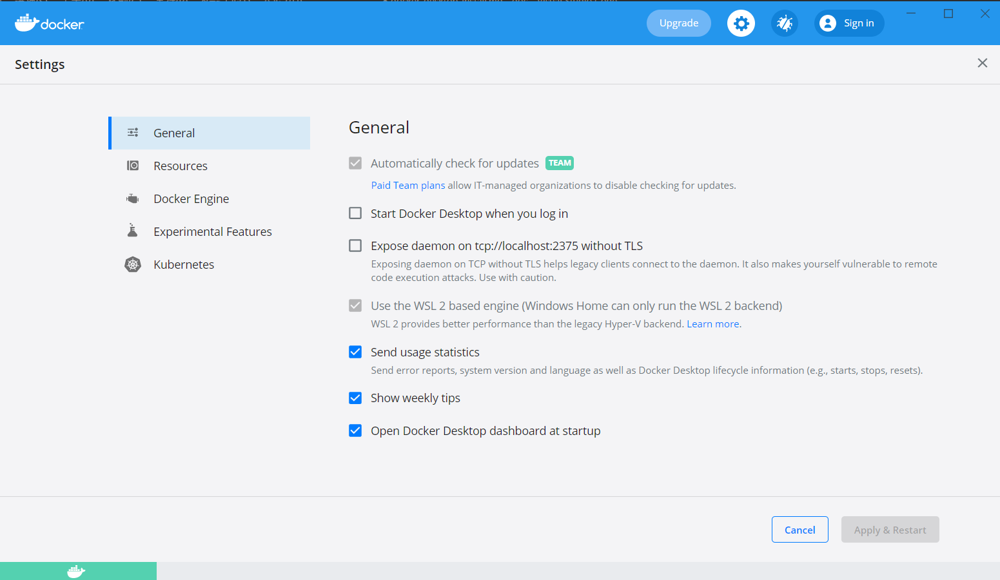

# Docker Desktop をインストール
Windows Home マシンで WSL2 バックエンドを使うと、Docker Desktop をインストールできます。
实际上是利用windows的WSL2机能。

## 1. install WSL

https://docs.microsoft.com/ja-jp/windows/wsl/install-win10

1. 启用wsl
    管理者として PowerShell を開き、以下を実行します。
    ```
    dism.exe /online /enable-feature /featurename:Microsoft-Windows-Subsystem-Linux /all /norestart
    ```
    以下2-4 是为了利用wsl2，如果用wsl1的话可以直接到5 install ubuntu

2. 仮想マシンの機能を有効にする
   管理者として PowerShell を開き、以下を実行します。
   ```
    dism.exe /online /enable-feature /featurename:VirtualMachinePlatform /all /norestart
    ```
    需要重启机器 

3. Linux カーネル更新プログラム パッケージをダウンロードしてインストールする
　　https://wslstorestorage.blob.core.windows.net/wslblob/wsl_update_x64.msi

4. WSL 2 を既定のバージョンとして設定する
    ```
    wsl --set-default-version 2
    ```

5. Microsoft Store を開き、ubuntuを選択してインストールします。
    需要设置用户、密码

6. 验证wsl
   在powershell中输入
   ```
    PS C:\WINDOWS\system32> wsl -l -v
    NAME      STATE           VERSION
    * Ubuntu    Stopped         2
   ```


## 2. install Docker Desktop

1. download Docker Desktop and install
https://hub.docker.com/editions/community/docker-ce-desktop-windows/

2. 安装完后确认


# Visual Studio Code Remote - WSL install

在Visual Studio Code安装wsl插件后，可以直接通过vscode 访问编辑Ubuntu中的项目